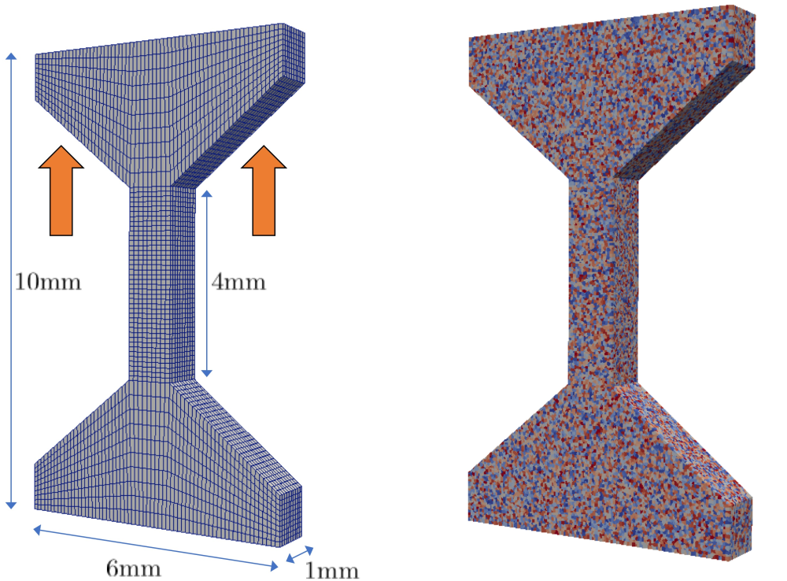

# AM Dogbone - from SPK to DAMASK

The idea of this project to model microstructure of high-throughput dogbone specimen through SPPARKS, and run the CPFEM through DAMASK.



# SPPARKS (+ DREAM.3D)

need a parser from SPPARKS to DAMASK `.geom` file.

Dimension: 10 mm (4 mm middle) x 6 mm x 1 mm

Attempted resolution:
1. 10 um: 60M pixels
	```
	variable     Nx     equal  600
	variable     Ny     equal  100
	variable     Nz     equal 1000
	```

2. 20 um: 7.5M pixels
	```
	variable     Nx     equal  300
	variable     Ny     equal   50
	variable     Nz     equal  500
	```

3. 50 um: 0.48M pixels
	```
	variable     Nx     equal  120
	variable     Ny     equal   20
	variable     Nz     equal  200
	```


# DAMASK
