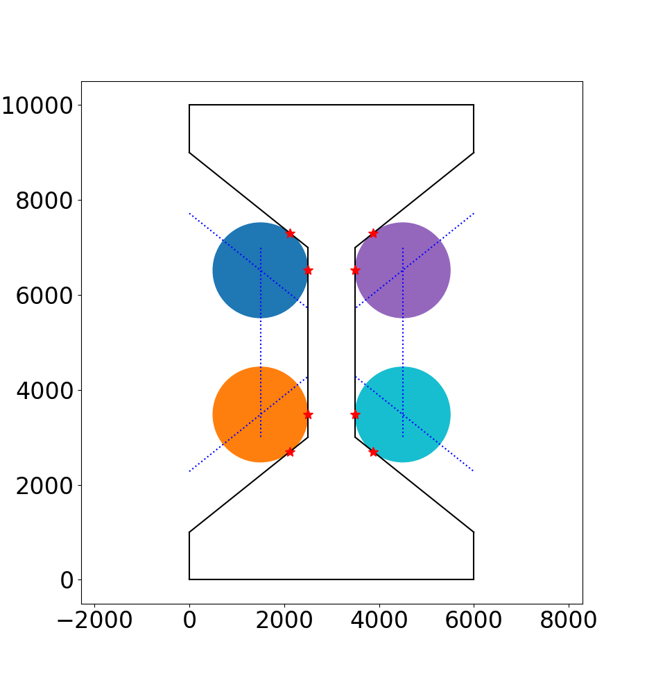

# AM Dogbone - from SPK to DAMASK

The idea of this project to model microstructure of high-throughput dogbone specimen through SPPARKS, and run the CPFEM through DAMASK. 

Sandia hosted a few videos about the high-throughput tensile testing (HTT) on [https://www.sandia.gov/am/materials-reliability/materials/](https://www.sandia.gov/am/materials-reliability/materials/) with several videos in `mp4` format (see these videos, for examples, [./1-s2.0-S0921509319314182-mmc2.mp4](./1-s2.0-S0921509319314182-mmc2.mp4), [./vizAm-htt-dogbone-nodefect.mp4](./vizAm-htt-dogbone-nodefect.mp4), [./vizAm-htt-dogbone-wDefect.mp4](./vizAm-htt-dogbone-wDefect.mp4), [./hi-res-tomography.mp4](./hi-res-tomography.mp4), [./alinstante.mp4](./alinstante.mp4), [./tensile-demo.mp4](./tensile-demo.mp4)).

* **High-throughput tensile testing**: To rapidly and inexpensively generate a statistically meaningful database for AM metal properties, Sandia created a unique, automated, high-throughput tensile testing system capable of testing approximately 100 samples/hour.
* **Computed tomography**: Computed tomography (CT) imaging of porosity in the gauge section of an AM printed “dog bone” tensile sample.

Here is a few versions of the dogbone specimens and their references:

How are these mades? See [https://doi.org/10.1016/j.msea.2019.138632](https://doi.org/10.1016/j.msea.2019.138632)
```
Printed arrays were designed specifically for the high-throughput set-up where each contained a total of 25 tensile samples, as illustrated in Fig. 2. Tensile samples had ratios consistent with geometries in ASTM E8, with a 1 x 1 x 4 mm reduced section with and utilized a 45 degree dovetail grip section for automated testing procedures. Each build plate contained up to 10 of these arrays (for a total of up to 250 tensile samples per build), with each array within the build printed under a specific set of processing parameters.
```

##### The born-qualified version: **17-4PH** materials

<!-- |  | -->
|  |
|:--:|
| *A picture from Tim's slides at https://www.osti.gov/servlets/purl/1877851*  |


<!-- |  | -->
|  |
|:--:|
| *Figure 1 in [https://doi.org/10.1002/adem.201700102](https://doi.org/10.1002/adem.201700102)* |


|  |
|:--:|
| *Defect distribution shown in Figure 3 of [https://doi.org/10.1002/adem.201700102](https://doi.org/10.1002/adem.201700102)* |

References:
* [https://doi.org/10.1016/j.jmatprotec.2016.10.023](https://dx.doi.org/10.1016/j.jmatprotec.2016.10.023): Salzbrenner, B. C., Rodelas, J. M., Madison, J. D., Jared, B. H., Swiler, L. P., Shen, Y. L., & Boyce, B. L. (2017). High-throughput stochastic tensile performance of additively manufactured stainless steel. Journal of Materials Processing Technology, 241, 1-12.
* [Combining Measure Theory and Bayes Rule to Solve a Stochastic Inverse Problem](https://www.osti.gov/servlets/purl/1877851): slides from Tim Wildey
* [https://doi.org/10.1002/adem.201700102](https://doi.org/10.1002/adem.201700102): Boyce, B. L., Salzbrenner, B. C., Rodelas, J. M., Swiler, L. P., Madison, J. D., Jared, B. H., & Shen, Y. L. (2017). Extreme‐value statistics reveal rare failure‐critical defects in additive manufacturing. Advanced Engineering Materials, 19(8), 1700102.


##### The A-/B- (large-/small-) size version: **AlSi10Mg**


<!-- |  | -->
|  |
|:--:|
| *Figure 1 in [https://doi.org/10.1007/s11837-021-04888-4](https://doi.org/10.1007/s11837-021-04888-4)* |


<!-- |  | -->
|  |
|:--:|
| *Figure 1 in [https://doi.org/10.1007/s11340-021-00696-8](https://doi.org/10.1007/s11340-021-00696-8)* |

References:
* [https://doi.org/10.1016/j.msea.2020.139922](https://doi.org/10.1016/j.msea.2020.139922): Laursen, C. M., DeJong, S. A., Dickens, S. M., Exil, A. N., Susan, D. F., & Carroll, J. D. (2020). Relationship between ductility and the porosity of additively manufactured AlSi10Mg. Materials Science and Engineering: A, 795, 139922.
* [https://doi.org/10.1007/s11837-021-04888-4](https://doi.org/10.1007/s11837-021-04888-4): Carroll, Jay D., Andrea N. Exil, Stephanie A. DeJong, Isaac A. Valdez, Christopher M. Laursen, Lisa A. Deibler, Christopher B. Finfrock, and Brad L. Boyce. "High-throughput statistical interrogation of mechanical properties with build plate location and powder reuse in AlSi10Mg." Jom 73 (2021): 3356-3370.
* [https://doi.org/10.1007/s11340-021-00696-8](https://doi.org/10.1007/s11340-021-00696-8): (*intentionally precipitated voids*) Smith, B. A., Laursen, C. M., Bartanus, J., Carroll, J. D., & Pataky, G. J. (2021). The interplay of geometric defects and porosity on the mechanical behavior of additively manufactured components. Experimental Mechanics, 61, 685-698.
* [https://doi.org/10.1063/1.5031506](https://doi.org/10.1063/1.5031506): J.D. Madison, O.D. Underwood, L.P. Swiler, B.L. Boyce, B.H. Jared, J.M. Rodelas, B.C. Salzbrenner, Corroborating Tomographic Defect Metrics with Mechanical Response in an Additively Manufactured Precipitation-Hardened Stainless Steel, 44th Annual Review of Progress in Quantitative Nondestructive Evaluation, Vol 37 1949(1) (2018) 020009.
* [https://doi.org/10.5006/2365](https://doi.org/10.5006/2365): R.F. Schaller, J.M. Taylor, J. Rodelas, E.J. Schindelholz, Corrosion Properties of Powder Bed Fusion Additively Manufactured 17-4 PH Stainless Steel, Corrosion 73(7) (2017) 796-807.

Microstructure info are in

* [https://doi.org/10.1557/jmr.2018.405](https://doi.org/10.1557/jmr.2018.405): P. Yang, L.A. Deibler, D.R. Bradley, D.K. Stefan, and J.D. Carroll, J. Mater. Res. 33, 4040-4052. (2018): Microstructure evolution and thermal properties of an additively manufactured, solution treatable AlSi10Mg part.
* [https://doi.org/10.1557/jmr.2018.82](https://doi.org/10.1557/jmr.2018.82): P. Yang, M.A. Rodriguez, L.A. Deibler, B.H. Jared, J. Griego, A. Kilgo, A. Allen, and D.K. Stefan, J. Mater. Res. 33, 1701–1712. (2018) (*contain microstructure information - Section III.B.2*): Effect of thermal annealing on microstructure evolution and mechanical behavior of an additive manufactured AlSi10Mg part.


##### **316L** dogbone


<!-- |  | -->
|  |
|:--:|
| *Figure 2 (25 tensile dogbones per array) in [https://doi.org/10.1016/j.msea.2019.138632](https://doi.org/10.1016/j.msea.2019.138632)* |


<!-- |  | -->
|  |
|:--:|
| *Figure 1 in [https://doi.org/10.1016/j.addma.2020.101090](https://doi.org/10.1016/j.addma.2020.101090)* |


<!--  | -->
|  |
|:--:|
| *Table 1 in [https://doi.org/10.1016/j.addma.2020.101090](https://doi.org/10.1016/j.addma.2020.101090)*. Note that the yield strength increases (slide 14 - https://www.osti.gov/servlets/purl/1643360) as the size increases. |


<!--  | -->
! |
|:--:|
| *Figure 1 in [https://doi.org/10.1016/j.addma.2022.102943](https://doi.org/10.1016/j.addma.2022.102943)*


<!-- |  | -->
|  |
|:--:|
| *Figure 3 in [https://doi.org/10.1016/j.msea.2019.138632](https://doi.org/10.1016/j.msea.2019.138632)* |


References:
* [https://doi.org/10.1016/j.msea.2019.138632](https://doi.org/10.1016/j.msea.2019.138632): Heckman, Nathan M., Thomas A. Ivanoff, Ashley M. Roach, Bradley H. Jared, Daniel J. Tung, Harlan J. Brown-Shaklee, Todd Huber et al. "Automated high-throughput tensile testing reveals stochastic process parameter sensitivity." Materials Science and Engineering: A 772 (2020): 138632.
* [https://doi.org/10.1016/j.addma.2020.101090](https://doi.org/10.1016/j.addma.2020.101090): Roach, A. M., White, B. C., Garland, A., Jared, B. H., Carroll, J. D., & Boyce, B. L. (2020). Size-dependent stochastic tensile properties in additively manufactured 316L stainless steel. Additive Manufacturing, 32, 101090.
* [https://doi.org/10.1016/j.addma.2022.102943](https://doi.org/10.1016/j.addma.2022.102943): Jensen, S. C., Koepke, J. R., Saiz, D. J., Heiden, M. J., Carroll, J. D., Boyce, B. L., & Jared, B. H. (2022). Optimization of stochastic feature properties in laser powder bed fusion. Additive Manufacturing, 56, 102943.
* [https://doi.org/10.1007/s11666-016-0480-y](https://doi.org/10.1007/s11666-016-0480-y): Yang, Nancy, J. Yee, B. Zheng, K. Gaiser, T. Reynolds, L. Clemon, W. Y. Lu, J. M. Schoenung, and E. J. Lavernia. "Process-structure-property relationships for 316L stainless steel fabricated by additive manufacturing and its implication for component engineering." Journal of Thermal Spray Technology 26 (2017): 610-626.

<!-- 4. **17-4PH** dogbone

* [https://doi.org/10.1016/j.jmatprotec.2016.10.023](https://doi.org/10.1016/j.jmatprotec.2016.10.023): High-throughput stochastic tensile performance of additively manufactured stainless steel -->


# SPPARKS (+ DREAM.3D + seedVoid.py)

~~need a parser from SPPARKS to DAMASK `.geom` file~~: `geom_spk2dmsk.py`

Attempts:
    1. 3D grain growth as conventional microstructure to benchmark AM: `spk/in.potts_3d`
    2. Simulating AM with parameters: `spk/in.potts_additive_dogbone`

SPPARKS commands used:
* [https://spparks.github.io/doc/variable.html](https://spparks.github.io/doc/variable.html)
* [https://spparks.github.io/doc/am_cartesian_layer.html](https://spparks.github.io/doc/am_cartesian_layer.html)
* [https://spparks.github.io/doc/am_pass.html](https://spparks.github.io/doc/am_pass.html)
* [https://spparks.github.io/doc/am_build.html](https://spparks.github.io/doc/am_build.html)
* [https://spparks.github.io/doc/app_potts_am_path_gen.html](~~https://spparks.github.io/doc/app_potts_am_path_gen.html~~)


Dimension: 10 mm (4 mm middle) x 6 mm x 1 mm

Attempted resolution:

```
dump.20.out -> spk/res-20um/dump.20.out
dump.12.out -> spk/res-50um/dump.12.out
dump.10.out -> spk/res-10um/dump.10.out
```

1. 10 um: 60M pixels
    ```
    variable     Nx     equal  600
    variable     Ny     equal  100
    variable     Nz     equal 1000
    ```

2. 20 um: 7.5M pixels
    ```
    variable     Nx     equal  300
    variable     Ny     equal   50
    variable     Nz     equal  500
    ```

3. 50 um: 0.48M pixels
    ```
    variable     Nx     equal  120
    variable     Ny     equal   20
    variable     Nz     equal  200
    ```

Input decks:

1. try with `t = 16.681021` corresponding to `spk/res-50um/dump.12.out`
2. DREAM.3D file for orientation generation: 
    1. run `test-Magnesium.json` to generate `material.config`
    2. rename `material.config` to `dream3d.material.config`
    3. `grep -ir 'phi1' dream3d.material.config > orientations.dat`
    4. (manually) remove all text in `orientations.dat`, only keep number
    5. save `orientations.dat`
3. sketch (and visualize) dogbone specimen using `draw_dogbone.py`.
For example: 
- medium fillet radius

- large fillet radius

- small fillet radius


4. `geom_cad2phase.py`: dump a phase matrix from dogbone geometry
    * produce a `.npy` file: `phase_' + dumpFileName.replace('.','_') + '.npy`
5. `geom_spk2dmsk.py`: 
    1. read `dump.12.out` and `orientations.dat`
    2. write `material.config`
    3. write `spk_dump_12_out.geom`
6. `../writeGeom.py`: write `.geom` file from a complete header and flatten 1d `geom` array
7. `../readGeom.py`: read `geom` file into 3d numpy array and other header variables (grid, size, etc.)


Results from exporting SPPARKS: 
* 50um
<!--  -->
|  |
|:--:|
| *50 um microstr  ucture geometry with log-normal distributed defects -- total 3% porosity* |

<!-- * 20um
 -->
|  |
|:--:|
| *20 um microstructure geometry with SPPARKS Potts normal grain growth* |

<!-- * 10um
 -->
|  |
|:--:|
| *10 um microstructure geometry with SPPARKS Potts normal grain growth* |

# DAMASK

Note: 0.49945833333333334 volume of fraction is void.

1. `geom` file is obtained from `geom_spk2dmsk.py`, might require `geom_cad2phase.py` run.
2. combine `material.config` and `material.config.preamble` for material and void
```shell
cat material.config.preamble  | cat - material.config | sponge material.config
```
3. void config is adopted from `Phase_Isotropic_FreeSurface.config` based on a conversation with Philip Eisenlohr.
```
[Void]

## Isotropic Material model to simulate free surfaces ##
## For more information see paper Maiti+Eisenlohr2018, Scripta Materialia, 
## "Fourier-based spectral method solution to finite strain crystal plasticity with free surfaces"

elasticity              hooke
plasticity              isotropic

/dilatation/

(output)                flowstress
(output)                strainrate

lattice_structure       isotropic
c11                     0.24e9
c12                     0.0
c44                     0.12e9
taylorfactor            3
tau0                    0.3e6
gdot0                   0.001
n                       5
h0                      1e6
tausat                  0.6e6
w0                      2.25
atol_resistance         1
```
4. create `vtr` file by `geom_check` command in DAMASK pre-/post-processing script. 

# ToDo (To-Do)

1. Adjust SPPARKS resolution (multi-resolution / multi-fidelity) either by DREAM.3D or personal script.

Maybe use 

* `scipy.signal.decimate()`: https://docs.scipy.org/doc/scipy/reference/generated/scipy.signal.decimate.html?
* `scipy.signale.resample()` (*periodic signal only*): https://docs.scipy.org/doc/scipy/reference/generated/scipy.signal.resample.html#scipy.signal.resample

Upsample/Downsample:
* `scipy.zoom`
```python
# https://docs.scipy.org/doc/scipy/reference/generated/scipy.ndimage.zoom.html#scipy.ndimage.zoom
from scipy.ndimage import zoom
origGeom = np.load('voidSeeded_3.000pc_potts-12_3d.975.npy') # (120, 20, 200)
downsampledGeom = zoom(origGeom, (0.5, 0.5, 0.5), order=0) # order must be 0 for disabling interpolation
np.save('downsampledGeom.npy', downsampledGeom)
```
* https://stackoverflow.com/questions/47775621/interpolate-resize-3d-array
* `numpy`
```python
import numpy as np
input_array=np.array([[1.,2],[3,4]])
np.resize(input_array, (3,3))
```
* `cv2`
```python
import cv2
import numpy as np
input_array=np.array([[1.,2],[3,4]])
cv2.resize(input_array,
           (3,3),
           interpolation=cv2.INTER_NEAREST)
```

2. ~~Implement a visualization pipeline for visualizing microstructure growth due to AM. Some ideas:~~

* ~~Only visualize the different part when comparing with initial microstructure~~
* ~~Only visualize the different between current and last time-step~~

See `vizAM.py`

3. Test out `restart` capability option: https://damask2.mpie.de/bin/view/Usage/SpectralSolver#Restart

##### `restart` examples
```
DAMASK_spectral --geom  PathToGeomFile/NameOfGeomFile.geom --load PathToLoadFile/NameOfLoadFile.load --workingdir PathToWorkingDir --restart XX
```

`--restart / -r / --rs XX`: Reads in total increment No. XX and continues to calculate total increment No. XX+1. Appends to existing results file 

4. ~~Test out `postResults` capability with `--filter` option: https://damask2.mpie.de/bin/view/Documentation/PostResults~~ (successful, see `findGaugeLocations.py`)

```
$ cat gaugeFilter.txt 
51 <= x <= 69 and 2 <= y <= 21 and 70 <= z <= 130
```

```shell
python3 ../../findGaugeLocations.py --geom ${geomFileName}.geom # dump gaugeFilter.txt
postResults *.spectralOut --cr f,p --filter $(cat gaugeFilter.txt)
```

5. ~~Implement a AM SPPARKS apps to generate microstructure from SPPARKS with possible visualization~~

6. ~~Implement a `pyvista` script that shows stresses warped by a deformed geometry.~~ (see `plotStress3dDeformedGeom.py`)

A DAMASK example is given by: https://damask2.mpie.de/bin/view/Usage/SpectralSolver
```
postResults --cr f,p --split --separation x,y,z 20grains16x16x16_tensionX.spectralOut

cd postProc
viewTable -a 20grains16x16x16_tensionX_inc100.txt

addCauchy 20grains16x16x16_tensionX_inc100.txt
addMises -s Cauchy 20grains16x16x16_tensionX_inc100.txt
viewTable -a 20grains16x16x16_tensionX_inc100.txt

addStrainTensors --left --logarithmic 20grains16x16x16_tensionX_inc100.txt
addMises -e 'ln(V)' 20grains16x16x16_tensionX_inc100.txt
viewTable -a 20grains16x16x16_tensionX_inc100.txt

vtk_rectilinearGrid 20grains16x16x16_tensionX_inc100.txt
vtk_addRectilinearGridData \
 --data 'Mises(Cauchy)',1_p,'1_ln(V)',1_Cauchy \
 --vtk '20grains16x16x16_tensionX_inc100_pos(cell).vtr' \
 20grains16x16x16_tensionX_inc100.txt

addDisplacement --nodal 20grains16x16x16_tensionX_inc100.txt

vtk_addRectilinearGridData \
 --data 'fluct(f).pos','avg(f).pos' \
 --vtk '20grains16x16x16_tensionX_inc100_pos(cell).vtr' \
 20grains16x16x16_tensionX_inc100_nodal.txt
```
followed by `Filters` > `Common` > `Warp By Vector` in ParaView from the menu and select first `avg(f).pos`. Select the new entry in the pipeline to visualize the uniformly deformed geometry. Similarly, choose `Filters` > `Common` > `Warp By Vector` from the menu and select first `fluct(f).pos` to also see the fluctuations resulting from the solution of static mechanical equilibrium. 

Also, see `plotStress3dDeformedGeom.py` implementation for showing a threshed mesh, warped by a deformation field `mesh.threshold().warp_by_vector()`.

An example is given in the PyVista documentation: https://docs.pyvista.org/version/stable/examples/01-filter/warp-by-vector.html

Some possible hints include

* https://github.com/pyvista/pyvista/issues/650
* https://discourse.paraview.org/t/visualizing-stress-on-the-deformed-geometry/654

7. ~~Seed void from a void geometry dictionary.~~ Maybe see some works from experimentalists, e.g. Andrew Polonsky, Philip Noell.

* Polonsky, A. T., Madison, J. D., Arnhart, M., Jin, H., Karlson, K. N., Skulborstad, A. J., ... & Murawski, S. G. (2023). Toward accurate prediction of partial-penetration laser weld performance informed by three-dimensional characterization–Part I: High fidelity interrogation. Tomography of Materials and Structures, 2, 100006.
* Karlson, K. N., Skulborstad, A. J., Madison, J. D., Polonsky, A. T., Jin, H., Jones, A., ... & Lu, W. Y. (2023). Toward accurate prediction of partial-penetration laser weld performance informed by three-dimensional characterization–part II: μCT based finite element simulations. Tomography of Materials and Structures, 2, 100007.
* Madison, J. D., & Aagesen, L. K. (2012). Quantitative characterization of porosity in laser welds of stainless steel. Scripta Materialia, 67(9), 783-786.

##### `postResults` Examples
* volume-averaged results of deformation gradient and first Piola-Kirchhoff stress for all increments
```
--cr f,p
```
* spatially resolved slip resistance (of phenopowerlaw) in separate files for increments 10, 11, and 12
```
--range 10 12 1 --increments --split --separation x,y,z --co resistance_slip
```
* get averaged results in slices perpendicular to x for all negative y coordinates split per increment
```
--filter 'y < 0.0'  --split --separation x --map 'avg'
```
* global sum of squared data falling into first quadrant arc between R1 and R2
```
--filter 'x >= 0.0 and y >= 0.0 and x*x + y*y >= R1*R1 and x*x + y*y <=R2*R2' --map 'lambda n,b,a: n*b+a*a'
```

See private communication with Philip Eisenlohr:
```
I believe restarting was already possible with DAMASK2. One needed to specify a restart frequency in the load file. Probably "r 10" or something to write out a restartable file every 10 increments. Restarting itself then required to add a —restart (maybe) argument to the DAMASK_spectral call and a load file that “runs” longer than the current restarting increment. I believe that the (binary) output file will just be extended with new data until the end of the load file is reached (regular termination).

The addDisplacment nodal should write a new file that contains the nodal displacements as a dataset. That data can be included when creating a VTK file (there is either two calls, one for all cell data, another for all nodal data, or both can be specified in one go...) Once the displacement is included in the VTK, you can "warp by vector" and use the displacements as source.
I believe what you are currently doing is to create cell displacements, which have the same data count as all other (cell) quantities. For (nicer) visualization, it might be advisable to add nodal displacements, which have more data points than cells (because there are one extra layer of nodes compared to cells). Then the above mentioned two-step/two-file solution is needed. Fortunately, VTK can contain both nodal and cell data in one container!

When running postResults, there is also an option to filter the data. You would probably use something along the lines of "z<upper and z>lower" with upper and lower the z-coordinates of the end of the gage section. The damask2 website (or help in postResutls) should explain this...
```

```
I am glad the simulations did work out. Looking at the structure now in more detail, I realize that the geometry is actually not a dogbone, but a dogsheet (fully periodic in Y). You might need to add some pixels of air to break material continuity along Y...

That your workstation is faster than an HPC might be attributable to differences in their hardware? An undergrad student of mine recently compared the efficiency of using cores for MPI or thread (openMP) parallelization and found that for large (enough) problems, the first about 8 cores can be indiscriminately distributed as either. With more resources at one’s disposal, throwing those towards MPI makes better sense since openMP appears to peter out in the high single digits (of threads).

What to do with such simulations is a good question. We all know that averaged results (for “simple” materials) are usually quite accurately reproduced. I am fairly certain that the volume averaged sigma_zz in the gage section would be equal to the volume average of the farthest (or probably any) Z layer of the widest head section. Together with either the displacement data at the ends of the gage section or the volume averaged gage strain, this stress–strain curve should reflect macroscopic behavior. Now, of course, you are actually not having a large number of grains in the gage section... Hence, evaluating the intrinsic variability (maybe as function of texture sharpness) for micro samples (with only "few" grains) might be a nice exercise (and example to be put on the DAMASK website).
```

8. Add `damage` and simulate fracture 

References:
1. [https://doi.org/10.1002/adem.201901044](https://doi.org/10.1002/adem.201901044) Diehl, Martin, Ding Wang, Chuanlai Liu, Jaber Rezaei Mianroodi, Fengbo Han, Duancheng Ma, Piet JJ Kok, Franz Roters, and Pratheek Shanthraj. "Solving material mechanics and multiphysics problems of metals with complex microstructures using DAMASK—The Düsseldorf advanced material simulation kit." Advanced Engineering Materials 22, no. 3 (2020): 1901044.
2. [https://doi.org/10.1007/s11837-017-2308-8](https://doi.org/10.1007/s11837-017-2308-8) Diehl, M., Wicke, M., Shanthraj, P., Roters, F., Brueckner-Foit, A., & Raabe, D. (2017). Coupled crystal plasticity–phase field fracture simulation study on damage evolution around a void: Pore shape versus crystallographic orientation. JOM, 69, 872-878.
3. [https://doi.org/10.1016/j.cma.2016.05.006](https://doi.org/10.1016/j.cma.2016.05.006) Shanthraj, P., Sharma, L., Svendsen, B., Roters, F., & Raabe, D. (2016). A phase field model for damage in elasto-viscoplastic materials. Computer Methods in Applied Mechanics and Engineering, 312, 167-185.

9. Extend to **cellular/metamaterials** architectures. See prior numerical works done by Minh-Son Pham and experimental works by Brad Boyce.

##### Efficient masking implementation

```python
# phase = {-1, np.inf}
maskedPhase = np.array(~np.isinf(phase), dtype=int)
maskedVti = np.multiply(maskedPhase, currentNpy)
maskedVti += 1
```


# Future directions

1. Tensile dogbone or gear with cellular or meta-materials. Maybe consider some topology-optimized geometry.
1. ~~Precipitate pores into dogbone~~ (see `seedVoid.py`)
```
@article{tran2024anomaly,
  title={Anomaly Detection in Materials Digital Twins with Multiscale ICME for Additive Manufacturing},
  author={Tran, Anh and Carlson, Max and Eisenlohr, Philip and Kolla, Hemanth and Davis, Warren},
  journal={Integrating Materials and Manufacturing Innovation},
  pages={1--14},
  year={2024},
  publisher={Springer}
}
```
1. POD ROM for polycrystalline materials?
1. Multi-fidelity ROM with POD/AE-based
1. Physics-informed machine learning
1. Stochastic inverse UQ with pores
1. Constitutive model calibration under uncertainty and pores
1. Microstructure-sensitive fracture?
1. Multi-fidelity UQ/SciML? Fusing computational + experimental
1. Fracture modeling with CPFEM/PF
1. Fatigue prediction

# Other references


### Experimental
1. B. Boyce, B. Salzbrenner, J. Rodelas, L. Swiler, J. Madison, B. Jared, Y. Shen, Extreme‐Value Statistics Reveal Rare Failure‐Critical Defects in Additive Manufacturing, Advanced Engineering Materials, 19(8) (2017) 1-10.
1. B. Jared, M. Aguilo, L. Beghini, B. Boyce, B. Clark, A. Cook, B. Kaehr, J. Robbins, Additive Manufacturing: Toward Holistic Design, Scripta Materialia, 135 (2017) 141-147.
1. B. Salzbrenner, J. Rodelas, J. Madison, B. Jared, L. Swiler, Y. Shen, B. Boyce, High-Throughput Stochastic Tensile Performance of Additively Manufactured Stainless Steel, Journal of Materials Processing Technology, 241 (2017) 1-12.
1. J.D. Madison, O.D. Underwood, L.P. Swiler, B.L. Boyce, B.H. Jared, J.M. Rodelas, B.C. Salzbrenner, Corroborating Tomographic Defect Metrics with Mechanical Response in an Additively Manufactured Precipitation-Hardened Stainless Steel, 44th Annual Review of Progress in Quantitative Nondestructive Evaluation, Vol 37 1949(1) (2018) 020009.
1. P. Yang, M.A. Rodriguez, L.A. Deibler, B.H. Jared, J. Griego, A. Kilgo, A. Allen, D.K. Stefan, Effect of thermal annealing on microstructure evolution and mechanical behavior of an additive manufactured AlSi10Mg part, Journal of Materials Research 33(12) (2018) 1701-1712.
1. R.F. Schaller, J.M. Taylor, J. Rodelas, E.J. Schindelholz, Corrosion Properties of Powder Bed Fusion Additively Manufactured 17-4 PH Stainless Steel, Corrosion 73(7) (2017) 796-807.
1. R.F. Schaller, A. Mishra, J.M. Rodelas, J.M. Taylor, E.J. Schindelholz, The Role of Microstructure and Surface Finish on the Corrosion of Selective Laser Melted 304L, Journal of The Electrochemical Society 165(5) (2018) C234-C242.
1. N. Yang, J. Yee, B. Zheng, K. Gaiser, T. Reynolds, L. Clemon, W. Lu, J. Schoenung, E. Lavernia, Process-structure-property relationships for 316L stainless steel fabricated by additive manufacturing and its implication for component engineering, Journal of Thermal Spray Technology 26(4) (2017) 610-626.
1. C.B. Finfrock, A. Exil, J.D. Carroll, L. Deibler, Effect of Hot Isostatic Pressing and Powder Feedstock on Porosity, Microstructure, and Mechanical Properties of Selective Laser Melted AlSi10Mg, Metallography, Microstructure, and Analysis  (2018) 1-14.
### Modeling & Simulation
1. T.M. Rodgers, J.E. Bishop, J.D. Madison, “Direct Numerical Simulation of Mechanical Response in Synthetic Additively Manufactured Microstructures” Modelling & Simulation in Materials Science and Engineering 2018, 26(5)
1. T.M. Rodgers, J. Mitchell, V. Tikare, “A Monte Carlo model for 3D grain evolution during welding” Modelling & Simulation in Materials Science and Engineering 2017, 25(6)
1. T.M. Rodgers, J. Madison, V. Tikare, “Simulation of Metal Additive Manufacturing Microstructures Using Kinetic Monte Carlo” Computational Materials Science 2017, 135: p. 78-89
1. E. Popova, T.M. Rodgers, X. Gong, A Cecen, J. Madison, S. Kalidindi, “Process-Structure Linkages Using a Data Science Approach: Application to Simulated Additive Manufacturing Data” Integr Mater Manuf Innov 2017
1. T.M. Rodgers, J. Madison, V. Tikare, M. Maguire, “Predicting Mesoscale Microstructural Evolution in Electron Beam Welding” JOM 2016, 68(5): p. 1419-1426
1. Stender, M.E., Beghini, L.L., Sugar, J.D., Veilleux, M.G., Subia, S.R., Smith, T.R., San Marchi, C.W., Brown, A.A., Dagel, D.J., “A Thermal-Mechanical Finite Element Workflow for Directed Energy Deposition Additive Manufacturing Process Modeling,” Additive Manufacturing, 2018. https://doi.org/10.1016/j.addma.2018.04.012
1. Johnson, K.L, Rodgers, T.M., Underwood, O.D., Madison, J.D., Ford, K.R., Whetten, S.R. Dagel, D.J., Bishop, J.E. “Simulation and Experimental Comparison of the Thermo-Mechanical History and 3D Microstructure Evolution of 304L Stainless Steel Tubes Manufactured Using LENS,” Computational Mechanics, 2018.  https://doi.org/10.1007/s00466-017-1516-y
1. Salloum, M., Johnson, K.L., Bishop, J.E., Aytec, J.M., Dagel, D.J., van Bloemen Waanders, B., “Adaptive Wavelet Compression of Large Additive Manufacturing Experimental and Simulation Datasets,” Computational Mechanics, 2018.  https://doi.org/10.1007/s00466-018-1605-6
1. Kustas, A.B., Susan, D.F., Johnson, K.L., Whetten, S.R., Rodriquez, M.A., Dagel, D.J., Michael, J.R., Keicher, D.M., Argibay, N. “Characterization of the Fe-Co-1.5V Soft Ferromagnetic Alloy Processed by Laser Engineered Net Shaping (LENS),” Additive Manufacturing (21), 2018.
